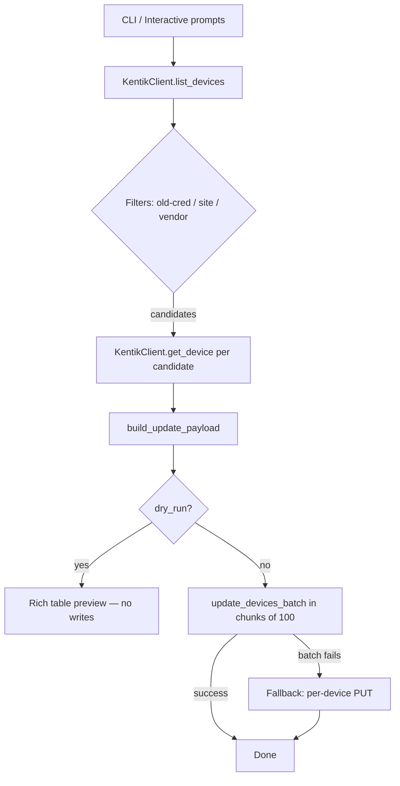

# kentik-snmp-migrate

Migrate Kentik device SNMP credentials from an SNMPv2 vault entry to
an SNMPv3 vault entry by swapping `nms.snmp.credentialName` on each
matching device — no vault reads, no inline credential fields, purely
a name update via the Kentik Device API (`v202504beta2`).


## Architecture



Every live update re-fetches the device immediately before building
its payload to guarantee `agentId`, `ipAddress`, and
`monitoringTemplateId` are current.

## Prerequisites

| Requirement | Version | Notes |
| --- | --- | --- |
| Python | 3.12+ | Managed automatically by `uv` |
| uv | Latest | `brew install uv` or `pip install uv` |
| Kentik API token | — | Scopes: `admin.device:read`, `admin.device:write`, `admin.credential:read` |

## Setup

Clone the repository and install dependencies:

```bash
git clone <repo-url>
cd kentik-device-update
uv sync
```

Copy the example env file and fill in your credentials:

```bash
cp .env.example .env
# Edit .env with your Kentik email and API token
```

Verify the install:

```bash
uv run kentik-snmp-migrate --help
```

## Configuration

All configuration is read from environment variables (or a `.env`
file in the project root).

| Variable | Required | Default | Description |
| --- | --- | --- | --- |
| `KENTIK_EMAIL` | Yes | — | Kentik user account email |
| `KENTIK_API_TOKEN` | Yes | — | Kentik API token |
| `KENTIK_API_BASE_URL` | No | `https://grpc.api.kentik.com` | Override for EU or staging |

## Usage

### Interactive mode (recommended)

Run with no flags. The script fetches live data from the API and
walks you through each step:

```bash
uv run kentik-snmp-migrate
```

```text
Fetching devices from Kentik API…
? Select the current (v2) SNMP credential to migrate from:
  > snmp-v2-prod
    snmp-v2-labs
    ──────────────────
    ← Quit

? Select the new (v3) SNMP credential:
  > snmp-v3-prod
    snmp-v3-labs
    ──────────────────
    ← Quit

? Filter by site? (3 available)
  > No filter — include all sites
    New York
    London
    Singapore
    ──────────────────
    ← Quit

? Filter by vendor? (2 available)
  > No filter — include all vendors
    cisco
    juniper
    ──────────────────
    ← Quit

┌──────────────────── Migration candidates ─────────────────────┐
│ Device Name  │ Site     │ Vendor │ Agent ID │ Current  │ New  │
│ core-rtr-01  │ New York │ cisco  │ 2512     │ snmp-v2… │ snmp │
│ core-rtr-02  │ New York │ cisco  │ 2512     │ snmp-v2… │ snmp │
└───────────────────────────────────────────────────────────────┘

? What would you like to do?
  > Dry-run (preview only, no changes)
    Apply changes
    ──────────────────
    ← Quit
```

All select prompts are styled in Kentik orange. Use arrow keys to
navigate; the highlighted row shows white text on an orange
background. Press Enter to confirm or select `← Quit` at any step
to exit cleanly.

After reviewing the candidate table, choose **Dry-run** first — the
script re-fetches each device and prints the exact JSON payload that
would be sent. Once the payloads look correct, re-run and choose
**Apply**.

### Non-interactive / CI mode

Pass `--old-credential` and `--new-credential` to skip all prompts.

**Dry-run with no filters** — preview every matching device and show
the exact JSON payload that would be sent for each:

```bash
uv run kentik-snmp-migrate \
  --old-credential snmp-v2-prod \
  --new-credential snmp-v3-prod \
  --dry-run
```

**Dry-run filtered by site:**

```bash
uv run kentik-snmp-migrate \
  --old-credential snmp-v2-prod \
  --new-credential snmp-v3-prod \
  --site "New York" \
  --dry-run
```

**Dry-run filtered by vendor:**

```bash
uv run kentik-snmp-migrate \
  --old-credential snmp-v2-prod \
  --new-credential snmp-v3-prod \
  --vendor cisco \
  --dry-run
```

**Live apply with site and vendor filters:**

```bash
uv run kentik-snmp-migrate \
  --old-credential snmp-v2-prod \
  --new-credential snmp-v3-prod \
  --site "New York" \
  --vendor cisco
```

**Live apply with debug output** — prints the exact JSON body before
each API write:

```bash
uv run kentik-snmp-migrate \
  --old-credential snmp-v2-prod \
  --new-credential snmp-v3-prod \
  --debug
```

**CI / automation — env vars inline, no `.env` file:**

```bash
KENTIK_EMAIL=ops@example.com \
KENTIK_API_TOKEN=<token> \
uv run kentik-snmp-migrate \
  --old-credential snmp-v2-prod \
  --new-credential snmp-v3-prod \
  --dry-run
```

## How it works

1. **List** — `GET /device/v202504beta2/device` returns all devices.
2. **Credential lookup** — `GET /credential/v202407alpha1/group`
   returns vault entries. The old-credential list is the intersection
   of device credential names and vault entries typed `SNMP_V1` or
   `SNMP_V2C`. The new-credential list shows only `SNMP_V3` entries.
   Falls back to free-text input if the credential API is unavailable
   or the `admin.credential:read` scope is missing.
3. **Filter** — candidates are devices whose
   `nms.snmp.credentialName` exactly matches the chosen old
   credential, optionally narrowed by site name and vendor type.
4. **Preview** — a Rich table shows every candidate with its current
   and proposed credential. In dry-run mode the script re-fetches
   each device and prints the exact PUT payload per device, then
   stops without writing anything.
5. **Re-fetch** — each candidate is individually re-fetched via
   `GET /device/{id}` to ensure `agentId`, `ipAddress`, and
   `monitoringTemplateId` are current.
6. **Build payloads** — a minimal PUT body is constructed per device
   (see [Caveats](#caveats) for field rules).
7. **Batch update** — devices are sent in chunks of up to 100 via
   `PUT /device/v202504beta2/device/batch_update`. If the batch
   endpoint rejects the payload, the script falls back to individual
   `PUT /device/{id}` calls per device.
8. **Results table** — a summary table lists every processed device
   with a ✓ Updated or ✗ Failed status. The run halts on the first
   failure; previously updated devices retain their new credential.

## Caveats

> [!WARNING]
> **`nms.snmp.port = 0` is not sent.** Kentik's API returns `0` for
> the SNMP port when the portal default (161) is in use. Sending `0`
> in a PUT resets the port and breaks polling. The script omits the
> port field whenever its value is `0`.

> [!WARNING]
> **Minimal payload only.** The GET response contains deprecated
> fields that cause errors if echoed back in a PUT. The script only
> sends `nms.agentId`, `nms.ipAddress`, `nms.snmp.credentialName`,
> and `monitoringTemplateId`. No other top-level device fields are
> included.

> [!NOTE]
> **`nms.st` (Streaming Telemetry) is included verbatim** when
> present on the freshly-fetched device. Omitting this block from a
> PUT **clears** the device's streaming-telemetry configuration
> (lab confirmed). Never remove it.

> [!NOTE]
> **`batch_update` accepts the same minimal payload** as the
> single-device endpoint (lab confirmed). The per-device fallback
> remains in place for any unexpected rejection.

## Lab testing checklist

The following question still requires validation:

1. What is the exact set of deprecated keys returned in GET responses
   that trigger PUT errors? Documenting these allows the payload
   builder to be hardened further.

Lab-confirmed findings:

- `batch_update` accepts the minimal NMS-only payload — full
  `DeviceConcise` is not required.
- Omitting `nms.st` from a PUT body **clears** streaming-telemetry
  config. The block must always be included when present.
- No fields beyond `monitoringTemplateId` have been found to be
  silently required in the PUT body.
